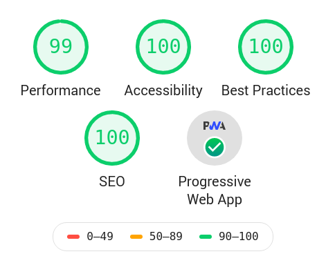

# Portfolio v2

**This repository has now been archived. New Website is stored in [this repository](https://github.com/haideralipunjabi/haideralipunjabi.com)**

Fork of [Portfoliov2 by CasperTheGhost](https://github.com/Dev-CasperTheGhost/portfolio-v2).  
Repository containing code for [my portfolio website](https://haideralipunjabi.com).

[Blog: Redesigning My Website - Automation, Custom SSG & Optimisations](https://blog.haideralipunjabi.com/posts/redesigning-my-website-automation-custom-ssg-optimisations/)

## How it Works  

1. [Forestry CMS](https://forestry.io/) is used to modify the `json` files in `data` folder
2. [Travis CI](https://travis-ci.org/) is used to run `.travis/build.py`, which uses [Jinja2](https://pypi.org/project/Jinja2/) to generate `index.html` from `templates/index.html`. It uses the data from `data` folder and also fetches new data (from Github and [my blog](https://blog.haideralipunjabi.com)) to generate the website. The website is generated once a day using a CRON Job.
3. [Travis CI](https://travis-ci.org/) then deploys the generated website to [Netlify](https://netlify.com)

## How it Performs

## Future Plans

* Add a *Uses* section
